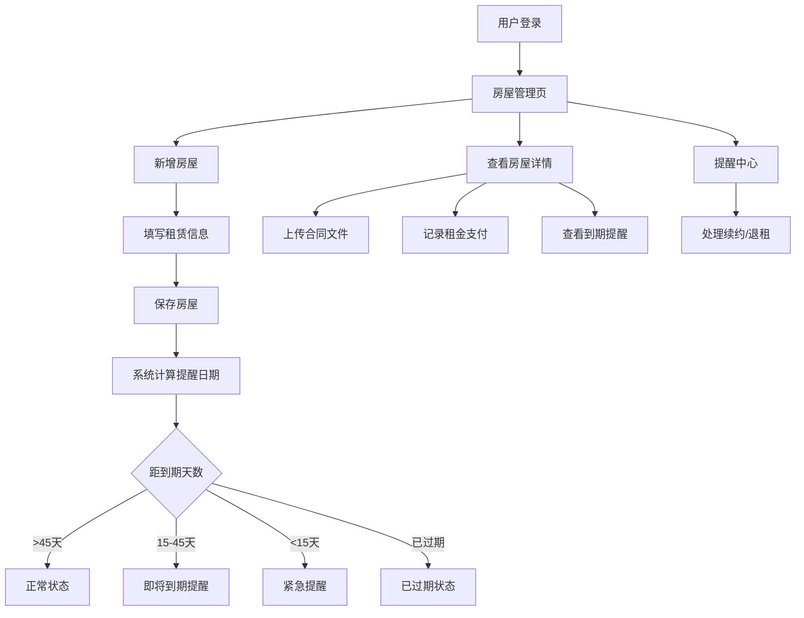

## 1. 产品概述

租房管理工具是一款面向租客的个人租赁信息管理应用，帮助用户集中管理租赁房屋信息、跟踪租金支付、上传合同存档，并在合同到期前自动推送续约/退租提醒。

- 解决租客信息分散、忘记续约时间、支付记录不清等痛点
- 目标用户为城市租房群体，提供一站式租赁管理体验

## 2. 核心功能

### 2.1 用户角色

| 角色 | 注册方式 | 核心权限 |
|------|----------|----------|
| 租客 | 邮箱注册 | 管理自己的租赁信息、支付记录、合同文件 |

### 2.2 功能模块

1. **房屋管理页**：房屋列表、新增/编辑/删除房屋信息、合同到期状态标签
2. **房屋详情页**：房屋详细信息、合同文件上传与预览、租金支付记录、续约/退租提醒
3. **提醒中心页**：聚合所有续约/退租提醒，按紧急程度排序

### 2.3 页面详情

| 页面名称 | 模块名称 | 功能描述 |
|----------|----------|----------|
| 房屋管理页 | 房屋列表 | 展示所有租赁房屋卡片，显示地址、租金、合同到期倒计时、状态标签（安全/即将到期/已过期） |
| 房屋管理页 | 新增/编辑弹窗 | 表单录入房屋信息：地址、房东姓名、房东电话、中介联系方式、租金、付款周期、押金金额、合同起止日期 |
| 房屋管理页 | 统计概览 | 显示在租数量、本月应付、即将到期数量 |
| 房屋详情页 | 基本信息 | 展示房屋完整信息，支持编辑 |
| 房屋详情页 | 合同文件 | 上传合同照片或PDF，支持预览和下载 |
| 房屋详情页 | 支付记录 | 记录每次租金支付日期和金额，支持新增/删除 |
| 房屋详情页 | 到期提醒 | 显示提醒时间线（45天/30天/15天），标记已触发提醒 |
| 提醒中心页 | 提醒列表 | 按紧急程度排序的续约/退租提醒，支持标记已处理 |

## 3. 核心流程

用户注册登录后，可新增租赁房屋信息，填写房东信息、租金、合同日期等。系统根据合同到期日自动计算并在到期前45天、30天、15天生成提醒。用户可在房屋详情页上传合同文件、记录租金支付。

## 4. 用户界面设计

### 4.1 设计风格

- 主色调：深墨绿色 (#1B4332) + 暖米色背景 (#FAF6F0)，传达安心、稳重的居住感
- 辅助色：琥珀色 (#D4A373) 作为强调色，用于提醒和重要操作
- 危险色：赤陶色 (#C1666B) 用于紧急提醒
- 按钮风格：圆角（8px）、微阴影、hover 时轻微上浮
- 字体：思源宋体风格衬线标题 + 无衬线正文，营造品质感
- 布局：左侧导航 + 右侧内容区，卡片式布局
- 图标风格：线性图标，线条粗细 1.5px

### 4.2 页面设计概览

| 页面名称 | 模块名称 | UI 元素 |
|----------|----------|---------|
| 房屋管理页 | 统计概览 | 三列统计卡片，深墨绿背景白色文字，数字大号加粗 |
| 房屋管理页 | 房屋列表 | 网格卡片布局，每张卡片左侧色条标识状态（绿/黄/红），显示地址、租金、倒计时天数 |
| 房屋管理页 | 新增/编辑弹窗 | 居中模态框，表单分组（基本信息/租赁信息/合同信息），底部操作按钮 |
| 房屋详情页 | 基本信息 | 双列信息展示，标签+内容格式，右上角编辑按钮 |
| 房屋详情页 | 合同文件 | 虚线上传区域 + 文件缩略图网格，支持拖拽上传 |
| 房屋详情页 | 支付记录 | 时间线式列表，每条显示日期、金额、操作按钮 |
| 房屋详情页 | 到期提醒 | 垂直时间线，45天/30天/15天三个节点，已触发节点高亮 |
| 提醒中心页 | 提醒列表 | 按紧急程度分组的卡片列表，紧急卡片左侧红色色条 |

### 4.3 响应式设计

- 桌面优先设计，内容区最大宽度 1200px
- 平板端：卡片从三列调整为两列
- 移动端：单列布局，底部导航替代侧边导航
