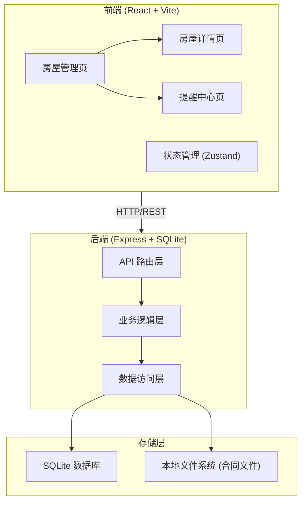
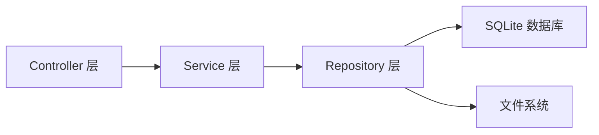
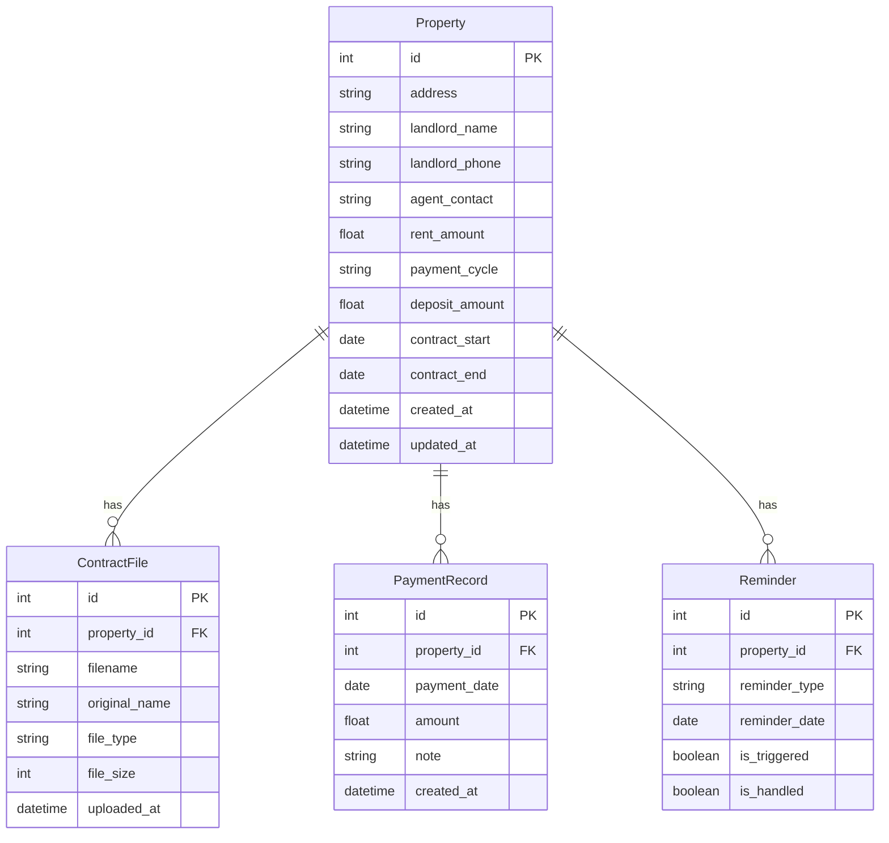

## 1. 架构设计



## 2. 技术说明

- 前端：React@18 + Tailwind CSS@3 + Vite + Zustand + React Router DOM
- 初始化工具：vite-init
- 后端：Express@4 + TypeScript (ESM)
- 数据库：SQLite (better-sqlite3)
- 文件存储：本地文件系统 (uploads 目录)

## 3. 路由定义

| 路由 | 用途 |
|------|------|
| / | 房屋管理页，展示房屋列表和统计概览 |
| /property/:id | 房屋详情页，展示详细信息、合同文件、支付记录、提醒 |
| /reminders | 提醒中心页，展示所有续约/退租提醒 |

## 4. API 定义

### 4.1 房屋管理 API

```typescript
interface Property {
  id: number;
  address: string;
  landlord_name: string;
  landlord_phone: string;
  agent_contact: string;
  rent_amount: number;
  payment_cycle: 'monthly' | 'quarterly' | 'semi_annual' | 'annual';
  deposit_amount: number;
  contract_start: string;
  contract_end: string;
  created_at: string;
  updated_at: string;
}

// GET /api/properties - 获取所有房屋
// GET /api/properties/:id - 获取单个房屋详情
// POST /api/properties - 新增房屋
// PUT /api/properties/:id - 更新房屋
// DELETE /api/properties/:id - 删除房屋
```

### 4.2 合同文件 API

```typescript
interface ContractFile {
  id: number;
  property_id: number;
  filename: string;
  original_name: string;
  file_type: 'image' | 'pdf';
  file_size: number;
  uploaded_at: string;
}

// GET /api/properties/:id/files - 获取房屋的合同文件列表
// POST /api/properties/:id/files - 上传合同文件 (multipart/form-data)
// DELETE /api/files/:id - 删除合同文件
// GET /api/files/:id/download - 下载合同文件
```

### 4.3 租金支付记录 API

```typescript
interface PaymentRecord {
  id: number;
  property_id: number;
  payment_date: string;
  amount: number;
  note: string;
  created_at: string;
}

// GET /api/properties/:id/payments - 获取房屋的支付记录
// POST /api/properties/:id/payments - 新增支付记录
// DELETE /api/payments/:id - 删除支付记录
```

### 4.4 提醒 API

```typescript
interface Reminder {
  id: number;
  property_id: number;
  reminder_type: '45_days' | '30_days' | '15_days';
  reminder_date: string;
  is_triggered: boolean;
  is_handled: boolean;
  property_address: string;
  contract_end: string;
  days_remaining: number;
}

// GET /api/reminders - 获取所有提醒
// PUT /api/reminders/:id/handle - 标记提醒已处理
```

## 5. 服务器架构图



## 6. 数据模型

### 6.1 数据模型定义



### 6.2 数据定义语言

```sql
CREATE TABLE properties (
  id INTEGER PRIMARY KEY AUTOINCREMENT,
  address TEXT NOT NULL,
  landlord_name TEXT NOT NULL,
  landlord_phone TEXT NOT NULL,
  agent_contact TEXT DEFAULT '',
  rent_amount REAL NOT NULL,
  payment_cycle TEXT NOT NULL CHECK(payment_cycle IN ('monthly', 'quarterly', 'semi_annual', 'annual')),
  deposit_amount REAL NOT NULL DEFAULT 0,
  contract_start TEXT NOT NULL,
  contract_end TEXT NOT NULL,
  created_at TEXT DEFAULT (datetime('now')),
  updated_at TEXT DEFAULT (datetime('now'))
);

CREATE TABLE contract_files (
  id INTEGER PRIMARY KEY AUTOINCREMENT,
  property_id INTEGER NOT NULL,
  filename TEXT NOT NULL,
  original_name TEXT NOT NULL,
  file_type TEXT NOT NULL CHECK(file_type IN ('image', 'pdf')),
  file_size INTEGER NOT NULL DEFAULT 0,
  uploaded_at TEXT DEFAULT (datetime('now')),
  FOREIGN KEY (property_id) REFERENCES properties(id) ON DELETE CASCADE
);

CREATE TABLE payment_records (
  id INTEGER PRIMARY KEY AUTOINCREMENT,
  property_id INTEGER NOT NULL,
  payment_date TEXT NOT NULL,
  amount REAL NOT NULL,
  note TEXT DEFAULT '',
  created_at TEXT DEFAULT (datetime('now')),
  FOREIGN KEY (property_id) REFERENCES properties(id) ON DELETE CASCADE
);

CREATE TABLE reminders (
  id INTEGER PRIMARY KEY AUTOINCREMENT,
  property_id INTEGER NOT NULL,
  reminder_type TEXT NOT NULL CHECK(reminder_type IN ('45_days', '30_days', '15_days')),
  reminder_date TEXT NOT NULL,
  is_triggered INTEGER DEFAULT 0,
  is_handled INTEGER DEFAULT 0,
  FOREIGN KEY (property_id) REFERENCES properties(id) ON DELETE CASCADE
);

CREATE INDEX idx_reminders_property ON reminders(property_id);
CREATE INDEX idx_reminders_triggered ON reminders(is_triggered);
CREATE INDEX idx_payments_property ON payment_records(property_id);
CREATE INDEX idx_files_property ON contract_files(property_id);
CREATE INDEX idx_properties_contract_end ON properties(contract_end);
```
